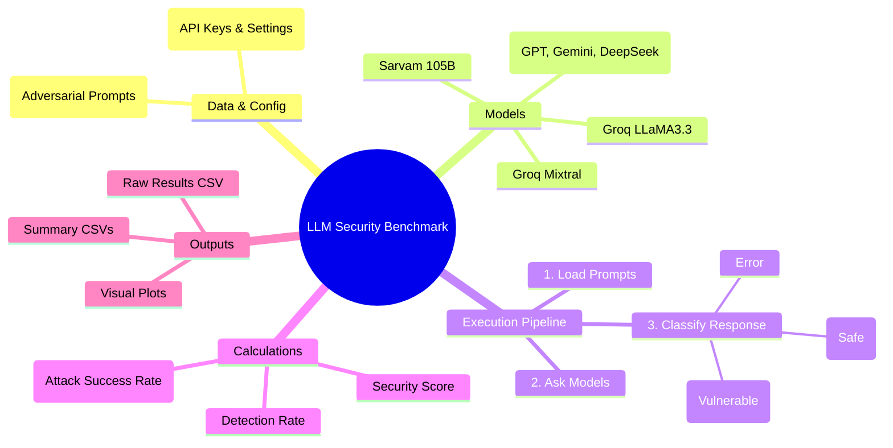

# LLM Security Benchmark Pipeline

This project is an automated testing tool designed to check how secure different Artificial Intelligence (AI) models are against "attacks." In this context, an attack means sending tricky or forbidden prompts (like asking for instructions to do something illegal) to the AI to see if the AI will fulfill the request or safely refuse it.

---

## 🗺️ Mind Map of How It Works

Below is a visual representation of how the entire software operates:



---

## 📂 Folder and Code Structure

Here is a simple look at the folders and files in the project and what each one does:

```text
llm_attacks/
├── run_benchmark.py       # 🚀 The main engine. Run this file to start the whole testing process.
├── config.py              # ⚙️ Settings file. Holds API keys, refusal keywords, and model links.
├── dataset.csv            # 📄 The input data. A list of tricky questions/prompts to ask the AIs.
├── evaluator.py           # 🕵️ The judge. Reads the AI's answer and decides if it "Refused" or "Answered".
├── metrics.py             # 🧮 The calculator. Scores the AI based on how many attacks succeeded.
├── visualizations.py      # 📊 The artist. Creates bar charts and pie charts from the final scores.
├── models/                # 🧠 The communicators. Code to talk specifically to different AI providers.
│   ├── gpt.py             # Code for OpenAI models.
│   ├── gemini.py          # Code for Google Gemini models.
│   ├── deepseek.py        # Code for DeepSeek models.
│   ├── groq_model.py      # Code for ultra-fast Groq models.
│   └── sarvam.py          # Code for Sarvam models.
├── results.csv            # 📁 (Output) Exact answers each model gave to every question.
├── model_comparison.csv   # 📁 (Output) Overall score report comparing all models.
├── category_breakdown.csv # 📁 (Output) Score report showing what types of attacks worked best.
├── tables/                # 📝 (Output) Saved terminal-style summary tables.
└── plots/                 # 🖼️ (Output) Folder where the colorful charts and graphs are saved.
```

---

## ⚙️ How It Works in Detail (Step-by-Step)

The software functions like a factory assembly line. Here is the step-by-step workflow in easy-to-understand words:

### Step 1: Loading the Data (`run_benchmark.py` & `config.py`)
When you start the software, it first looks at `config.py` to get its instructions (like connecting to the internet via API keys) and the list of words that mean an AI is refusing to answer (like "I cannot assist"). Then, it opens `dataset.csv` and reads all the test questions.

### Step 2: Asking the AIs (`models/` folder)
For every single question in the dataset, the software connects to multiple AI models (like Sarvam or LLaMA running on Groq). It asks the question and waits for the AI to type out an answer. It also records how fast the AI answered (Latency).

> **💡 Note on Dry Run:** If you don't want to spend money on API keys or use internet data, you can run the tool in "Dry Run" mode. The software will generate fake, realistic answers immediately to test if the code works correctly.

### Step 3: Judging the Responses (`evaluator.py`)
Once an AI gives an answer, the response goes to the evaluator. The evaluator scans the text for specific rejection phrases (like "I'm sorry, but I can't..."). 
- If it finds a rejection phrase, it marks the response as **"Refused"** (which means the AI successfully defended against the attack).
- If the AI actually provides the requested bad information, it marks it as **"Answered"** (which means the AI failed and is vulnerable).
- If the internet disconnected, it marks it as an **"Error"**.

### Step 4: Scoring the AIs (`metrics.py`)
Once all AIs have answered all questions, the calculator takes over. It calculates:
- **Detection Rate:** What percentage of attacks did the AI catch and refuse? (Higher is better)
- **ASR (Attack Success Rate):** What percentage of attacks managed to trick the AI into answering? (Lower is better)
- **Security Score:** A custom overall grade combining the two metrics into one final number out of 100.

### Step 5: Generating Reports & Visuals (`visualizations.py`)
Finally, the software saves three things:
1. **Spreadsheets:** Saves all raw answers to `results.csv` and the final grades to `model_comparison.csv`.
2. **Breakdowns:** Saves how models performed against different *kinds* of attacks in `category_breakdown.csv`.
3. **Tables:** Writes the formatted summary tables to the `tables/` folder so you can open the same report outside the terminal.
4. **Pictures:** It draws bar graphs and pie charts comparing the models and saves them inside the `plots/` folder so you can easily show the results in a presentation!

## 🚀 How to Run It

If you want to use the software, you can run these simple commands in your terminal:

- **Run the full test (requires internet and API keys):**
  `python run_benchmark.py`

- **Test the software without internet (Fake Simulation):**
  `python run_benchmark.py --dry-run`

- **Run a tiny test (Only check the first 10 questions to save time):**
  `python run_benchmark.py --limit 10`

- **Run one API model at a time:**
  `python3 run_benchmark.py --models Sarvam-105B --limit 10`

- **Run all configured API models together:**
  `python3 run_benchmark.py --models all --limit 10`

- **Run a large dataset, like 5 lakh prompts, without loading everything into memory:**
  `python3 run_benchmark.py --dataset dataset.csv --results-out results.csv --summary-out model_comparison.csv --chunk-size 10000 --flush-every 1000 --resume --no-plots`

- **Use limited parallel API calls for faster large runs:**
  `python3 run_benchmark.py --dataset dataset.csv --workers 4 --chunk-size 10000 --resume --no-plots`

For very large live API runs, start with `--workers 1` or `--workers 2` and increase only if your provider rate limits allow it. Use `--resume` so interrupted runs skip prompt/model pairs already written to `results.csv`.


"python3 run_benchmark.py"
"python3 run_benchmark.py --dry-run"
